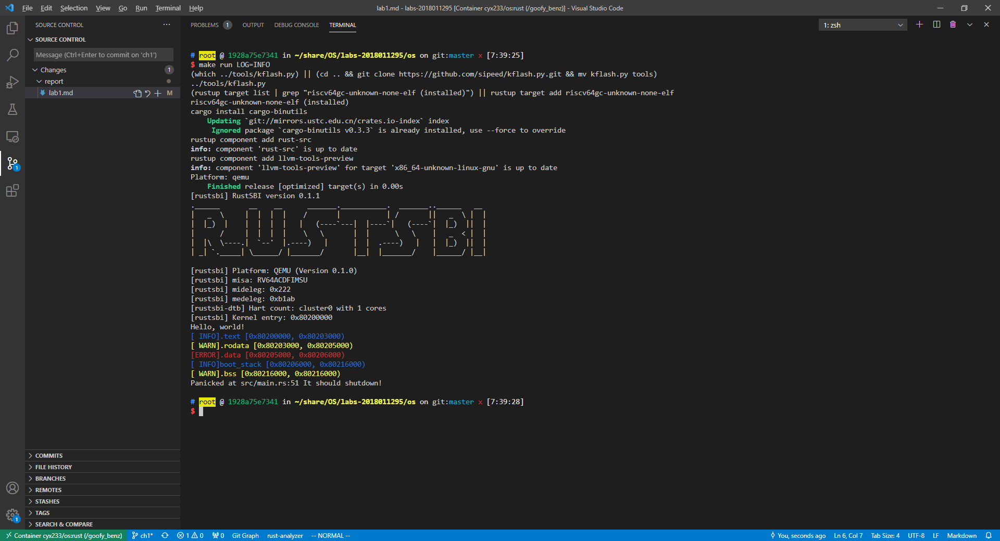

# Chapter 1
## 实验内容
1. 配置开发环境
2. 完成了裸机上支持字符串输出的三叶虫OS,包括初始化与正常关机。
3. 支持了彩色的日志输入
## 实验结果

## 问答作业 
### 第1题
mideleg和medeleg，midelg:0x222，medeleg:0xb1ab
### 第2题
1. 运行位于0x1000的指令，读取mhartid
2. 跳转至0x80000000执行起始代码，进入start我()函数进行一些检查后调用main()函数
3. main()函数设置异常处理、中断委托，初始化mepc和mstatus，并调用rustsbi::enter_priviledged()执行mret命令，进入S模式并跳转到s_mode_start()函数。
4. s_mode_start()函数加载0x80200000到寄存器ra并跳转，开始执行OS的代码。