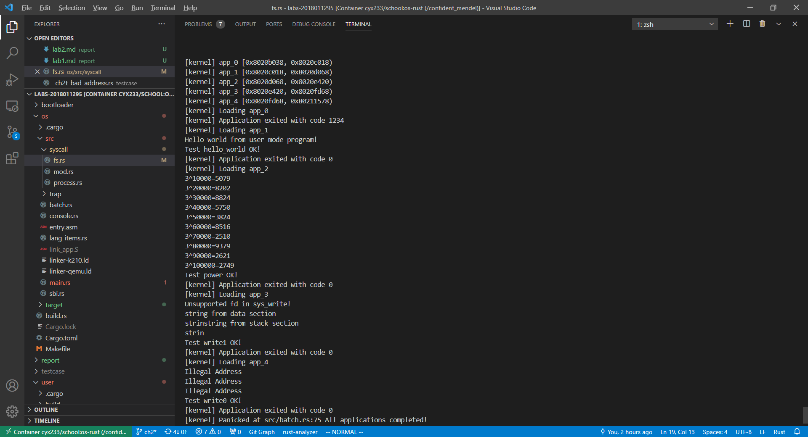
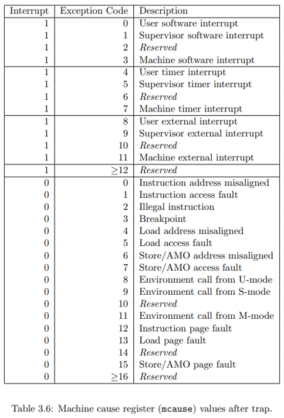

# Chapter 2
## 实验内容
1. 完成了sys_write的访问地址检测。代码段使用APP_SIZE_LIMIT为限制，用户栈使用0x1000为限制，暂时不需要动态的限制。
2. 对错误的sys_write打印出错信息并返回-1，不立即杀死程序。
3. 整理了git，重新完成了lab1的内容并与lab2合并
## 实验结果

## 问答作业 

1. 正确进入 U 态后，程序的特征还应有：使用 S 态特权指令，访问 S 态寄存器后会报错。目前由于一些其他原因，这些问题不太好测试，请同学们可以自行测试这些内容（参考前3个测例)，描述程序出错行为，同时注意注明你使用的 sbi 及其版本。

   答：
   版本:RustSBI version 0.2.0-alpha.1

   出错行为:
   _ch2_bad_instruction.rs:用户态执行``sret``,报错IllegalIstruction.

   _ch2_bad_register.rs:用户态执行``csrr``访问``sstatus``,报错IllegalIstruction.

   _ch2_bad_instruction.rs:用户态访问地址0x0,报错PageFault
2. 请结合用例理解trap.S中两个函数 ``__alltraps`` 和 ``__restore`` 的作用，并回答如下几个问题:
   1. L40: 刚进入 ``__restore`` 时，``a0`` 代表了什么值。请指出 ``__restore`` 的两种使用情景。

      答：
      ``a0``代表了保存了 Trap 上下文之后的内核栈栈顶

      场景1: 通过``__restore``开始运行app

      场景2: 处理trap之后通过``__restore``回到U态

   2. L46-L51: 这几行汇编代码特殊处理了哪些寄存器？这些寄存器的的值对于进入用户态有何意义？请分别解释。
      ```mips
         ld t0, 32*8(sp)
         ld t1, 33*8(sp)
         ld t2, 2*8(sp)
         csrw sstatus, t0
         csrw sepc, t1
         csrw sscratch, t2
      ```
      答： 特殊处理了sstatus,sepc,sscratch

      sstatus: SPP 等字段给出 Trap 发生之前 CPU 处在哪个特权级（S/U）等信息

      sepc: 当 Trap 是一个异常的时候，记录 Trap 发生之前执行的最后一条指令的地址

      sscratch: 这几步将用户栈栈顶地址保存到了sscrach中，现在sp保存内核态栈顶地址。在执行``sret``进入用户态前，会通过``csrrw sp,sscrach,sp``交换两者的值，使sp正确指向用户态栈顶。
   3. L53-L59: 为何跳过了 ``x2`` 和 ``x4``？ 
		```mips
         ld x1, 1*8(sp)
         ld x3, 3*8(sp)
         .set n, 5
         .rept 27
            LOAD_GP %n
            .set n, n+1
         .endr
		```
      答:
      ``x2(sp)``会在之后保存到``sscratch``

      `x4(tp)`不会在用户程序使用
   4. L63: 该指令之后，``sp`` 和 ``sscratch`` 中的值分别有什么意义？
		```mips
		csrrw sp, sscratch, sp
		```
      答:
      ``sp``:用户栈栈顶地址

      ``sscratch``:内核栈栈顶地址
   5. ``__restore``：中发生状态切换在哪一条指令？为何该指令执行之后会进入用户态？

      答:
      发生在``sret``。硬件执行pop privilege stack，将特权等级设置为sstatus::SPP。 sstatus::SPP 可以由 app_init_context() 设置为用户态，或在执行ecall指令时由CPU设置，或在处理trap时被操作系统设置。
   6. L13： 该指令之后，``sp`` 和 ``sscratch`` 中的值分别有什么意义？
		```mips
		csrrw sp, sscratch, sp
		```
      答：
      ``sp``:内核态栈顶地址
      ``sscratch``:用户态栈顶地址

   7. 从 U 态进入 S 态是哪一条指令发生的？

      答： L38: call trap_handler， trap_handler 函数会根据 scause的值分发异常。Enviroment Call 会调用ecall指令，完成状态切换。

3. 程序陷入内核的原因有中断和异常（系统调用），请问 riscv64 支持哪些中断 / 异常？如何判断进入内核是由于中断还是异常？描述陷入内核时的几个重要寄存器及其值。

   答：

   若 mcause[31] == 1 是中断，否则是异常。

   重要寄存器(x=m或s):
   - xstatus：保存了当前和上一个CPU的特权状态
   - xtvec：保存了trap的处理模式和处理代码地址
   - medeleg/mideleg：保存了异常委托的信息
   - xip/xie：xip保存了当前产生的中断， xie保存了允许的中断
   - xscratch：临时寄存器
   - xepc：保存异常/中断发生时的pc值
   - xcause：保存异常/中断的原因
   - xtval：保存异常的额外信息

4. 对于任何中断， ``__alltraps`` 中都需要保存所有寄存器吗？你有没有想到一些加速 ``__alltraps`` 的方法？简单描述你的想法。

   答：
   不需要。当确定操作系统在处理各个种类异常时都用到了哪些寄存器，就可以在trap_handler进行分类，然后根据类型，只保存和恢复相应的寄存器，达到加速的目的。