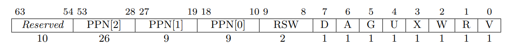

# Chapter 4
## 实验内容
1. 实现了虚拟地址与页表
2. 修改了get_time，使其能够使用虚拟地址进行调用
## 实验结果
见CI-CD
## 简答作业
1. 

	PPN:物理地址

	RSW:给操作系统保留的位

	D:在写回策略中，表示该项是否已经被写

	A:表示改项是否被读

	G:表示改项全局合法

	U:表示改项User态是否允许访问

	X:表示该地址是否能够执行

	W:表示该地址是否能够写

	R:表示该地址是否能够读

	V:直接作用是表示该项是否合法。增加项时，需要V=0；删除项与查询项时，需要V=1.
2. 
- 缺页导致一系列Page Fault的异常，包括Instruction Page Fault, Load Page, Store/AMO Page Fault。
- stval存储出错的虚拟地址，scause寄存器存储异常类型，sepc寄存器存储发生异常的指令的地址。其他的寄存器信息与一般异常相同，无特殊之处。
- 主要有两方面的好处。首先是加载程序时间更快，而且可以异步的访问磁盘，先通过调度执行其他程序，CPU利用率高。第二个好处是读入的数据较少，内存利用效率比较高。
- 按照3级页表6，1页4KB，页表项64位（8B）计算。10GB空间需要2621140个页表项。则需要三级页表2621140/512=5120页，则需要二级页表10页，一级页表1页。共5131页，即20524KB，约为20MB。
- 可以在map时，仅在MemorySet类中做记录，而不实际分配内存。在发生缺页时，检查地址是否位于MemorySet记录的内存空间中。如果合法，则在此时分配内存；如果不合法，则进行异常处理。
- PTE驻留位为0，进入Page Fault处理程序，由OS进行判断与处理。

3. 
- 切换进程时将进程对应的一级页表首地址存入satp。
- U=0的页面User态无法访问。
- 节省空间。
- 切换进程以及切换CPU特权等级时需要更换页表。单页表的OS只需要在切换进程时切换页表，一个进程的不同特权等级使用同个页表。