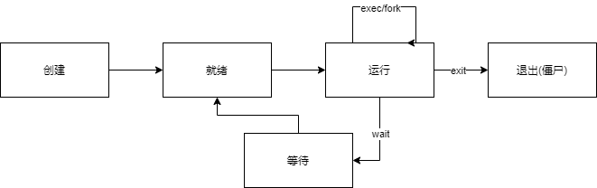

# Chapter 5
## 实验内容
1. 实现了sys_spawn
2. 合并了lab1-lab4的新增内容
## 实验结果
见CI-CD
## 简答作业
1. Copy On Write策略，如果读取的话就不分配独立资源，与原进程共用资源。写入时再Copy
2. (1).fork()线程不安全，只能用于单线程进程。(2).即使使用了Copy On Write策略，fork()速度仍然很慢。
3. main.rs
```rust
fn main() {
    let a = get_a();
	spawn("b",1,[&a as *const u8]);
    println!("a = {}", a);
    0
}
```
b.rs 编译生成b
```rust
fn main(args:[*const u8]) {
	let b = get_b();
	println!("a + b = {}", args[0] + b);
    println!("a = {}", args[0]);
	0
}
```
fork可以直接复制父进程，不需要编写其他的文件,可以共享父进程的数据和代码。

4. 有产生，等待，就绪，运行，退出（僵尸）


fork/exec在运行态执行，执行后仍为运行态。fork生成的子进程为就绪态。

wait在运行态执行，执行后进入等待态。

exit让进程从running转为terminated。