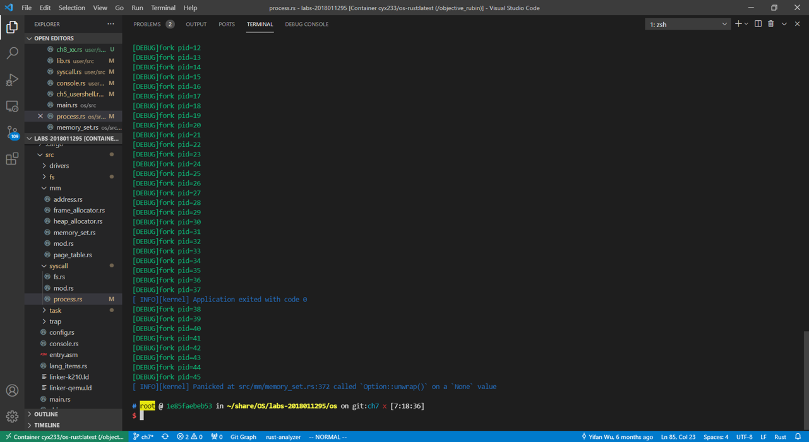
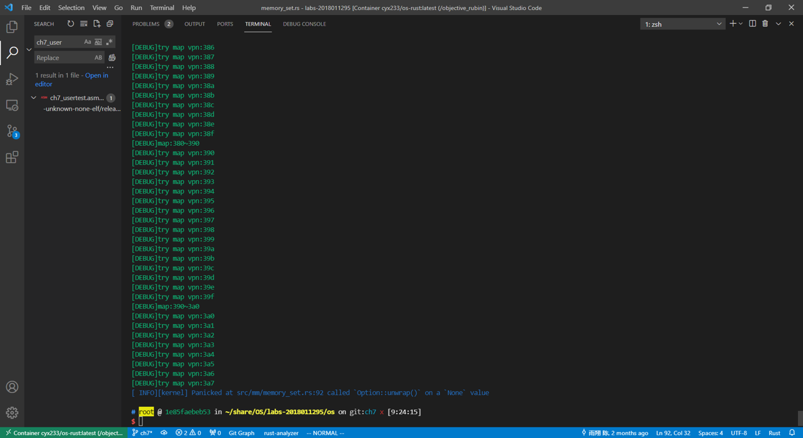
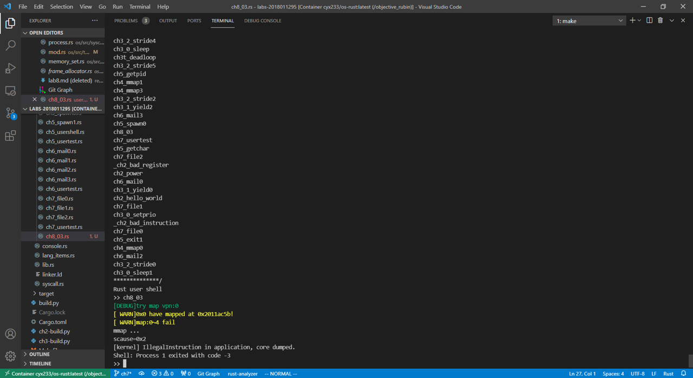
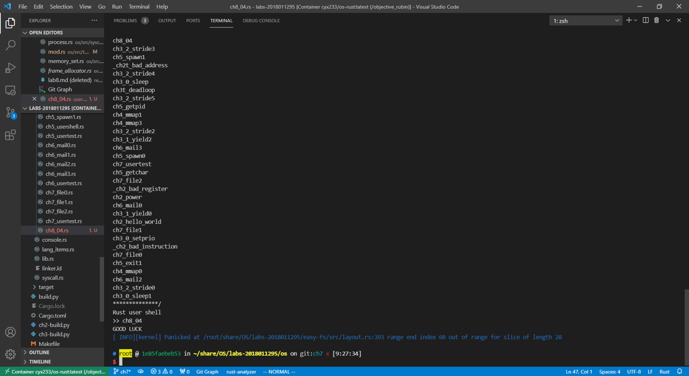
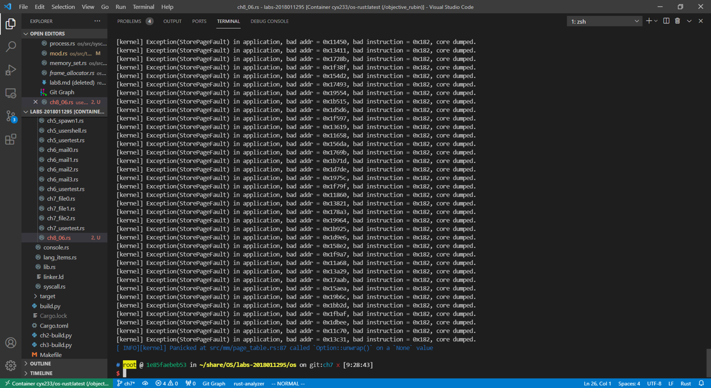
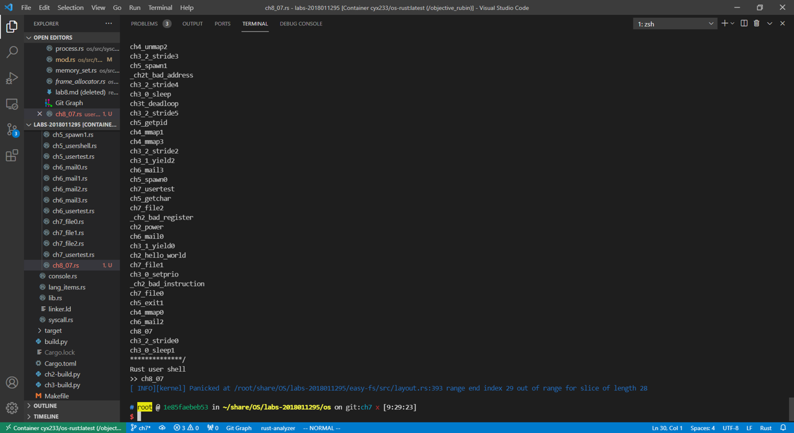

# Chapter 7
## 测例分析
### ch8\_01

由于 fork() 调用过多，耗尽了内存，再次调用MemorySet::from_existed_user() 时失败崩溃。

解决方法：
- MapArea::map_one() 、 MapArea::map() 和 MemorySet::push() 函数返回 isize ，表示操作是否成功。
- MemorySet::from_existed_user() 返回 Option<MemorySet> ，在该函数内检查内存分配是否成功，不成功则返回 None .
- TaskControlBlock::fork()返回Option<Arc<TaskControlBlock>>, 检查是否成功分配内存空间，失败则返回None
- sys_fork()检查TaskControlBlock::fork()是否成功，失败则直接kill()当前进程
### ch8\_02
 
由于 mmap() 调用过多，耗尽了内存，再次调用MemorySet::map_dynamic() 时失败崩溃。

解决方法：
- MemorySet::map_dynamic()检查是否分配成功，若失败则返回错误码

### ch8\_03

发生了 IllegalInstruction 的错误。推测是由于 raw_sys_fstat 传入了代码段的地址，导致将要执行的代码数据被修改，出现非法指令。
### ch8\_04

ch8_04.rs 第 28 行调用 open 函数时，文件名过长，引起内核崩溃。

解决方法:
- 修改DirEntry::new() ，当文件名过长时进行截断操作
- 文件名可能是 ASCII 之外的字符，使用is_char_boundary()检查截断的位置是否是字符分界。
### ch8\_05 
与 ch8_01 中过多 fork() 的问题一样。
### ch8\_06

有2个问题
1. 由于fork()时没有复制 mmap 分配的内存空间到子进程，所以子进程访问这部分内存时出现了页缺失(StorePageFault)。
2. 内核崩溃的原因是在 PageTable::find_pte_create 中没有检查是否有足够空间分配页帧，导致内存不够时出现错误。

解决方法：
- 在 fork() 时为子进程调用 mmap ，复制父进程通过 mmap 分配的空间
- 在 PageTable 中添加无法分配的错误检测和处理
### ch8\_07

由于创建超过磁盘最大可容纳数量的文件，导致磁盘空间不足，内核崩溃

解决方法：
- 在Bitmap::alloc 、 EasyFileSystem::alloc_inode() 、 Inode::create() 等函数调用中添加错误检查，当磁盘空间不足时返回错误码，避免内核崩溃。

## 编程内容
### ch8_05

```rust
pub fn map_one(&mut self, page_table: &mut PageTable, vpn: VirtPageNum) -> isize {
	...
		MapType::Framed => {
			if let Some(frame) = frame_alloc() {
				ppn = frame.ppn;
				self.data_frames.insert(vpn, frame);
			} else {
				return -1;
			}
	...
}

```
```rust
pub fn map(&mut self, page_table: &mut PageTable) -> isize {
	for vpn in self.vpn_range {
		if self.map_one(page_table, vpn) == -1 {
			return -1;
		}
	}
	return 0;
}

```
```rust
fn push(&mut self, mut map_area: MapArea, data: Option<&[u8]>) -> isize {
	if map_area.map(&mut self.page_table) == -1 {
		return -1;
	}
	...
}

```
```rust
pub fn from_existed_user(user_space: &MemorySet) -> Option<MemorySet> {
	...
		if memory_set.push(new_area, None) == -1 {
			return None;
		}
	...
}

```
```rust
pub fn sys_fork() -> isize {
    let current_task = current_task().unwrap();
    if let Some(new_task) = current_task.fork() {
		...
    } else {
        log::info!("Fork Failed!");
        return -1;
    }
}
```
若fork失败，则返回错误码

### ch8_02
```rust
pub fn map_dynamic(
	&mut self,
	start_va: VirtAddr,
	end_va: VirtAddr,
	map_perm: MapPermission,
) -> isize {
	...
		if let Some(frame) = frame_alloc() {
			...
		} else {
			return -1;
		}
	...
}
```
若没有空间，则返回分配失败错误码

### ch8_06
```rust
pub fn new(name: &str, inode_number: u32) -> Self {
	let mut bytes = [0u8; NAME_LENGTH_LIMIT + 1];
	if name.as_bytes().len() > NAME_LENGTH_LIMIT {
		for index in 28..1 {
			if name.is_char_boundary(index) {
				&mut bytes[..index].copy_from_slice(&name.as_bytes()[..index]);
				break;
			}
		}
	} else {
		&mut bytes[..name.len()].copy_from_slice(name.as_bytes());
	}
	Self {
		name: bytes,
		inode_number,
	}
}
```
修改DirEntry::new()，加入字符串截取的部分